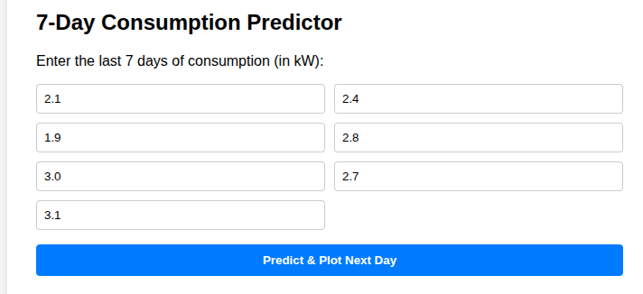
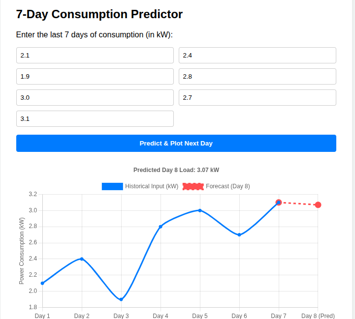
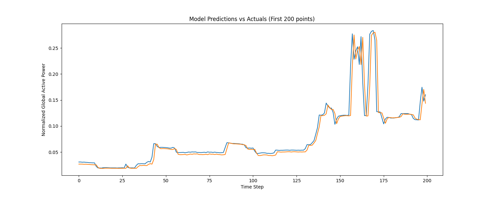

# ⚡ Household Power Consumption Forecasting Web App

An end-to-end time-series demand forecasting application built with PyTorch and FastAPI to predict household electricity consumption.

---

## 📊 Prediction & Analytics Dashboard

| **24-Hour Power Demand Forecast** | **Model Performance & Dashboard** |
|:---:|:---:|
|  |  |

**Key Highlights:**
* **Dynamic Time-Series Graph:** Visualizes predicted vs. historical `Global_active_power` trajectories using interactive Chart.js graphs.
* **Engineered Temporal Features:** Integrates temporal feature extraction (hour, day, weekday, weekend flags) and calculated metrics (`Sub_metering_4`).
* **Fast PyTorch Inference:** Serves real-time model predictions normalized via a pre-fitted MinMaxScaler pipeline.

---

## Evalution:
**Show 200 hundered comparsion of actual and predicted values through line graph**
|:---:|:---:|
     


## 📁 Project Architecture

```text
power_app/
├── app/
│   ├── __init__.py
│   ├── main.py             # FastAPI app initialization and route definitions
│   ├── model.py            # PyTorch LSTM network architecture
│   ├── schemas.py          # Pydantic request/response data validation
│   └── predictor.py        # Model loading, feature scaling, & inference pipeline
├── artifacts/
│   ├── model.pt            # Serialized PyTorch model state_dict
│   └── scaler.pkl          # Serialized MinMaxScaler object
├── static/
│   └── style.css           # Frontend styles and pics of models
├── templates/
│   └── index.html          # HTML dashboard with Chart.js integration
├── data/
│   └── dataset.csv         # Household power consumption dataset
├── requirements.txt        # Python dependency manifest
└── README.md
